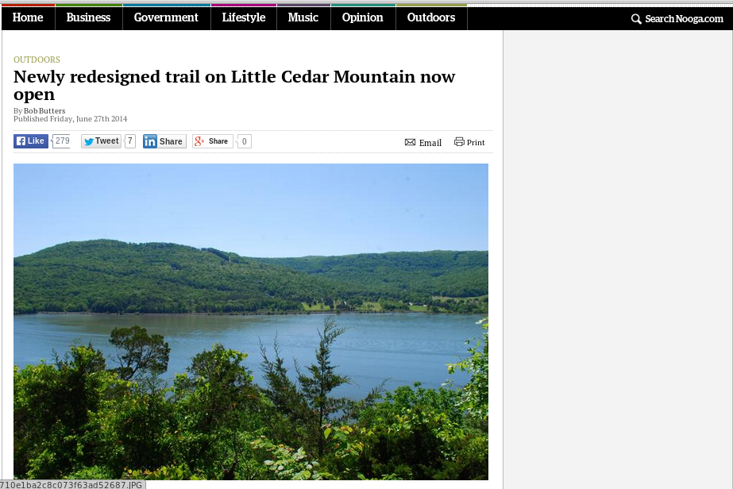
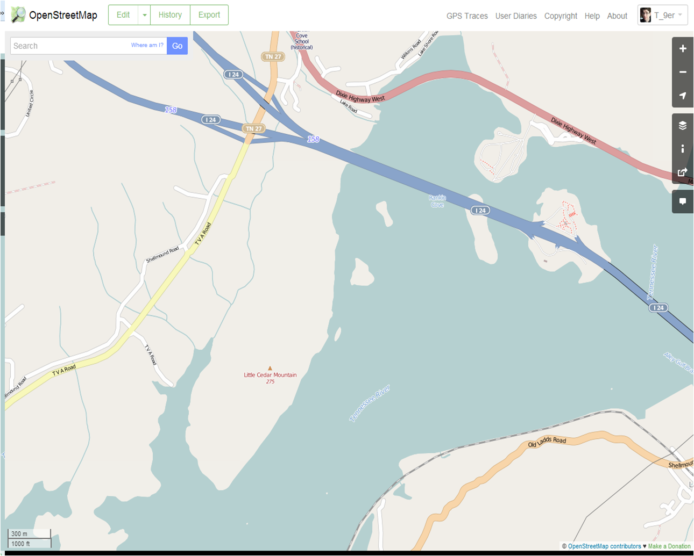
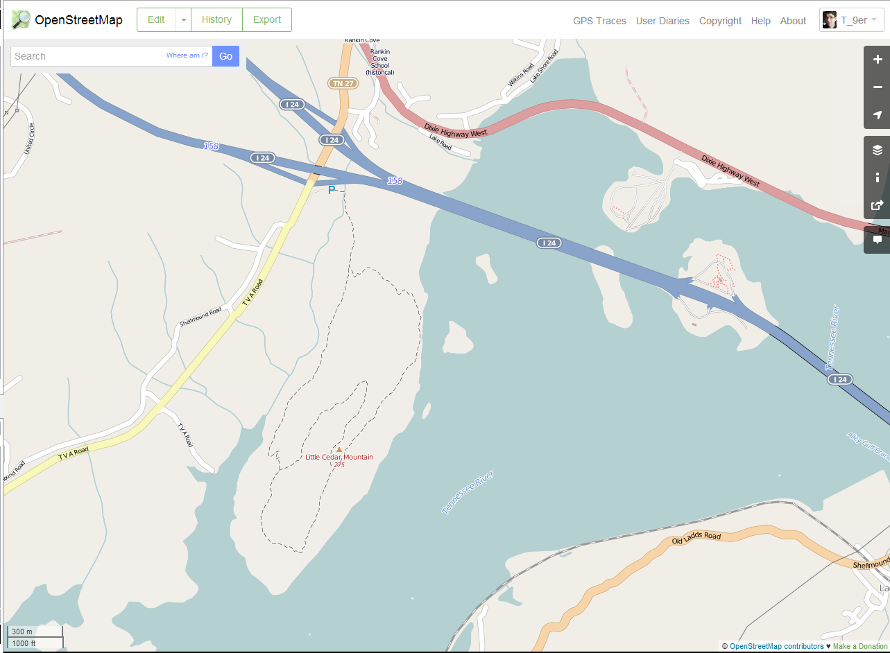

#OSM 101 Part 1 Outline

<!--OPENING/HOUSEKEEPING SLIDES-->

<em>OSM</em> 101 Part One <a href="http://bit.ly/osm-101">bit.ly/osm-101</a>

Housekeeping! You can follow along here: <a href="http://bit.ly/osm-101">bit.ly/osm-101</a>. Links are in blue boxes, <em>green</em> is just emphasis. Change slides w/ arrow keys. You can comment and edit on <a href="https://github.com/aplannersguide/osm-101">github!</a>

<!--WHAT IS OSM-->

What is OpenStreetMap?

OpenStreetMap is the <a href="https://www.google.com/search?q=%22wikipedia+of+maps%22">"Wikipedia of maps"</a>

Anyone (like YOU!) can edit OSM

And here is the beauty piece, anyone (like YOU!) can have/use the OSM data

<!--A BOY AND HIS MAP-->

How do you know OSM is for you?

Does this bother you?

OMFG make it stop!!!

Do you have to do something about this?

Before

After

<!--SAY HI TO OSM - LETS GET READY TO MAPj-->

So, let's sign up <a href="https://www.openstreetmap.org/user/new">now!</a>

Where to learn more: <a href="http://learnosm.org">www.learnosm.org</a> <a href="http://wiki.openstreetmap.org">wiki.osm.org</a> <a href="http://help.openstreetmap.org">help.osm.org</a>

To learn how to add any kind of thing to the map: <a href="http://wiki.openstreetmap.org/wiki/Map_Features">wiki.osm.org / wiki / Map_Features</a>

Am I doing it the <em>right way?</em> Read about <a href="http://wiki.openstreetmap.org/wiki/Good_practice">wiki.osm.org / wiki / Good_practice</a>

Let's get started!

Two ways to edit OSM: web editor <a href="https://wiki.openstreetmap.org/wiki/ID">iD</a> or advanced editor <a href="https://josm.openstreetmap.de/">JOSM</a>

iD: just click edit up in the corner ↖︎

<em>JOSM</em>

<!--GET TO KNOW OSM-->

Look: layers! ⬈

Look: notes!⬊

data model: nodes / ways / relations 

OK! But what should I edit first? <em>Suggestions:</em>

Go to your neighborhood or home town

Trace some buildings

Add some POIs (points of interest)

Play <a href="http://maproulette.org">MapRoulette</a>

Fix some <a href="http://maproulette.org/battlegrid">TIGER data</a>

Do some <a href="http://tasks.hotosm.org/">HOT tasks</a> (Humanitarian OSM Team)

Get outside!

What not to do:

Main rule of thumb: no copying from Google products!

OSM is licensed under the Open Database License: <a href="http://opendatacommons.org/licenses/odbl/">ODbL</a>

More on that another time...

Now lets get started doing some mapping!

Presentation made with <a href="http://www.macwright.org/big/">big</a>

#OSM 101 Part 2 Outline

